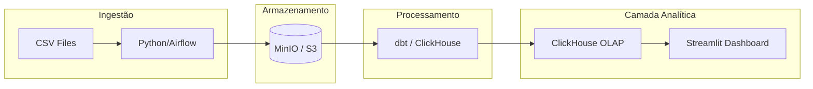

# 20261sre-projeto-final

Este projeto realiza o processamento e análise dos dados do dataset Northwind, focando em uma arquitetura moderna de dados (Modern Data Stack).

## 1. Modelagem de Dados

Baseado nos arquivos `northwind_orders.csv` e `northwind_order_details.csv`.

### Modelo Conceitual
- **Entidades:**
  - **Pedido (Order):** Representa a transação de compra.
  - **Item do Pedido (Order Detail):** Representa os produtos individuais dentro de um pedido.
- **Relacionamento:** Um Pedido possui um ou mais Itens (1:N).

### Modelo Lógico
- **Tabela `orders`:**
  - `order_id` (PK, Integer)
  - `customer_id` (String/FK)
  - `employee_id` (Integer/FK)
  - `order_date` (Date)
  - `required_date` (Date)
  - `shipped_date` (Date)
  - `ship_via` (Integer)
  - `freight` (Decimal)
  - `ship_name`, `ship_address`, `ship_city`, `ship_region`, `ship_postal_code`, `ship_country` (String)
- **Tabela `order_details`:**
  - `order_id` (PK/FK, Integer)
  - `product_id` (PK, Integer)
  - `unit_price` (Decimal)
  - `quantity` (Integer)
  - `discount` (Float)

### Modelo Físico (ClickHouse)
```sql
CREATE TABLE orders (
    order_id Int32,
    customer_id String,
    employee_id Int32,
    order_date Date,
    required_date Date,
    shipped_date Nullable(Date),
    ship_via Int32,
    freight Decimal(18, 2),
    ship_name String,
    ship_address String,
    ship_city String,
    ship_region Nullable(String),
    ship_postal_code Nullable(String),
    ship_country String
) ENGINE = MergeTree()
ORDER BY order_id
PARTITION BY toYYYYMM(order_date);

CREATE TABLE order_details (
    order_id Int32,
    product_id Int32,
    unit_price Decimal(18, 2),
    quantity Int16,
    discount Float32
) ENGINE = MergeTree()
ORDER BY (order_id, product_id);
```

## 2. Arquitetura da Stack



## 3. Decisões e Trade-offs

| Decisão | Alternativa Descartada | Motivo da Escolha |
| :--- | :--- | :--- |
| **ClickHouse** | PostgreSQL | O ClickHouse é um banco OLAP que oferece performance superior para consultas analíticas e agregações em grandes volumes de dados. |
| **MinIO (S3)** | HDFS | MinIO é compatível com a API S3, facilitando a portabilidade para nuvem e sendo mais leve para ambientes de container/Codespaces. |
| **Streamlit** | Tableau/PowerBI | Streamlit permite manter a visualização como código (Python), facilitando o versionamento e integração no pipeline. |
| **MergeTree Engine** | Log Engine | MergeTree suporta índices, partições e é a engine padrão para alta performance no ClickHouse. |