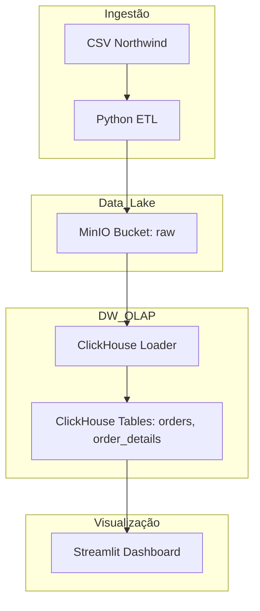

# Design do Sistema

## Arquitetura da Stack de Dados

## Modelagem de Dados
...
- `order_details`: Ordenado por `order_id` e `product_id` para co-localização de dados do mesmo pedido.

## Infraestrutura de Containers

O ambiente é composto por três containers principais definidos no `docker-compose.yml`:

| Serviço | Imagem | Descrição | Portas (Host) |
|:---|:---|:---|:---|
| **ClickHouse** | `clickhouse/clickhouse-server` | Banco de dados OLAP para armazenamento analítico. | 8123 (HTTP), 9004 (Nativa) |
| **MinIO** | `minio/minio` | Object Storage para simular o S3 localmente. | 9000 (API), 9001 (Console) |
| **App** | `python:3.11-slim` (Build local) | Container Python com as ferramentas de ETL, dbt e Streamlit. | 8501 (Streamlit) |

### Fluxo de Setup
1. **Docker Compose:** Sobe os containers e inicializa os volumes.
2. **setup.sh:** Script executado dentro do container `app` que:
    - Cria buckets `raw` e `processed` no MinIO via Boto3.
    - Sobe os CSVs da pasta `dados_northwind/` para o bucket `raw`.
    - Cria a tabela `ingestion` no ClickHouse.
    - Executa o script `ingestion.py` que converte os CSVs em JSON e os insere na tabela `ingestion`.

## Estratégia de Ingestão (Bronze/Raw JSON)

A ingestão segue o padrão de "Raw Staging", onde o esquema do banco não é rígido no momento da carga.

**Estrutura da Tabela `ingestion`:**
| Coluna | Tipo | Descrição |
|:---|:---|:---|
| `ingestion_timestamp` | `DateTime64(3)` | Momento exato da carga (Unix Time). |
| `data` | `String` (JSON) | Linha completa do CSV serializada como objeto JSON. |
| `tag` | `String` | Nome do arquivo de origem (ex: `northwind_orders.csv`). |

**Minha Opinião Técnica:**
Esta abordagem é excelente para **resiliência e rastreabilidade**. Ao salvar o dado bruto como JSON:
1. **Esquema Evolutivo:** Se o CSV ganhar novas colunas amanhã, a ingestão não quebra.
2. **Reprocessamento:** Podemos reconstruir a camada Silver sem precisar ler os arquivos originais novamente.
3. **Auditoria:** Sabemos exatamente o que veio de cada arquivo e quando.
*Ponto de Atenção:* O custo é um leve aumento no uso de armazenamento e a necessidade de usar funções de JSON do ClickHouse (ex: `JSONExtractString`) nas transformações dbt, o que é muito performático no ClickHouse.
