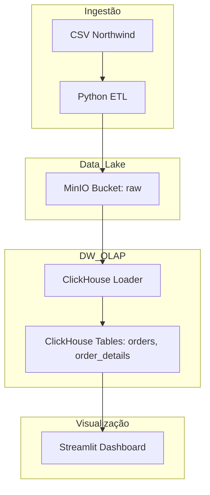

# Design do Sistema

## Arquitetura da Stack de Dados

## Modelagem de Dados

### Modelo Conceitual
O modelo foca no relacionamento entre pedidos e seus itens. 

- **Order (Pedido):** Cabeçalho do pedido com informações de cliente, data e destino.
- **Order Detail (Detalhe):** Linhas do pedido com produto, preço unitário e quantidade.

### Modelo Lógico
Cardinalidade: 1 Order -> N Order Details.
A chave primária de `order_details` é a composição de `order_id` e `product_id`.

### Modelo Físico
Implementado no ClickHouse utilizando a engine `MergeTree` para otimização de consultas analíticas.
- `orders`: Particionado por mês da `order_date`.
- `order_details`: Ordenado por `order_id` e `product_id` para co-localização de dados do mesmo pedido.
